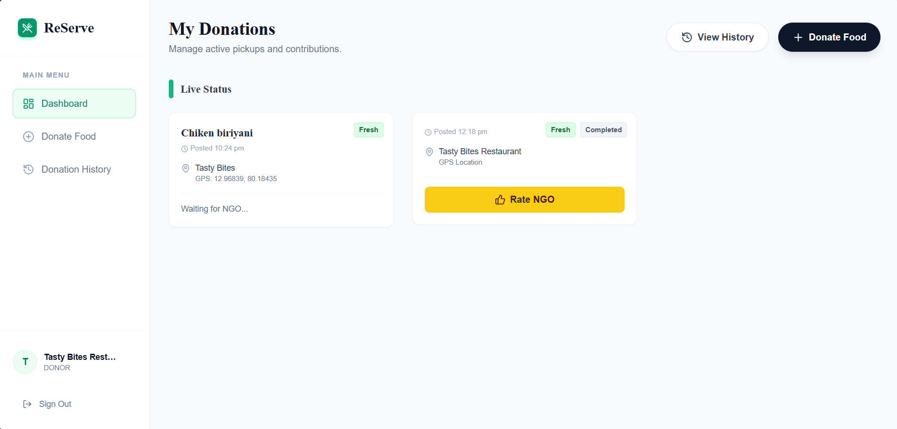
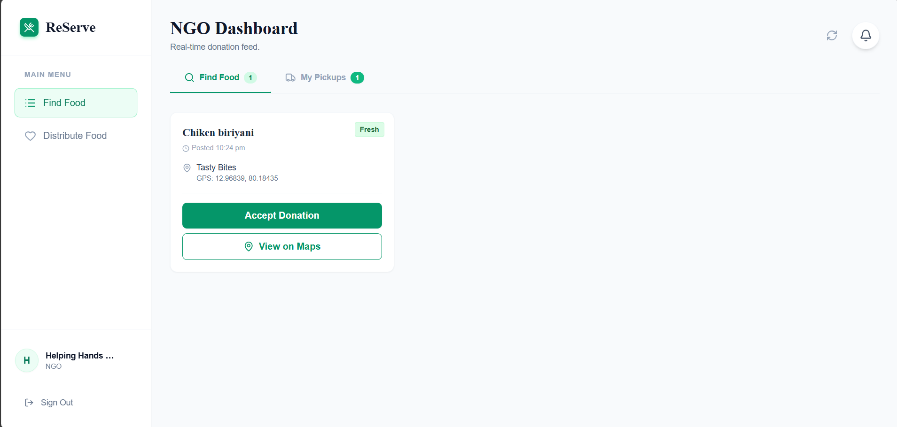
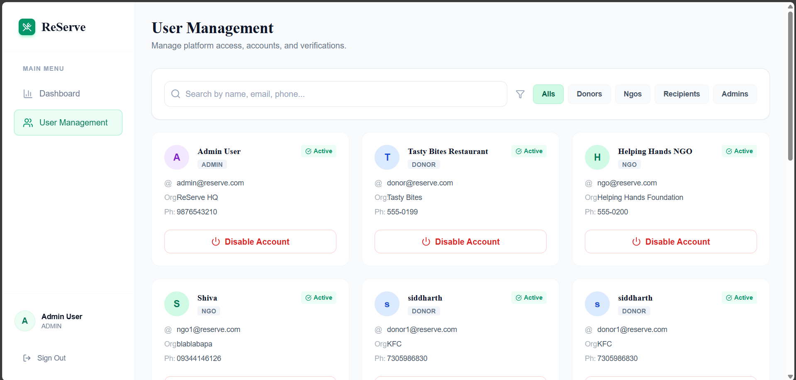

# ReServe

ReServe is a full-stack web application for food donation management. Donors can post surplus food with location and safety details, NGOs can accept and track donations, admins monitor requests and pickups in real-time, and organizations can view verified donation details and track past contributions.

## Workflow / Features

### Donor Side
- Uploads surplus food with preparation time & storage type
- Location auto-detected and donation posted
- Receives pickup confirmation & tracking updates

### NGO Side
- Views live donor list with food safety status
- Accepts suitable donations based on capacity
- Uses in-app navigation for optimized pickup route

### Admin Side
- Monitors all active requests & pickups in real time
- Validates safety alerts and manages vehicle allocation
- Tracks metrics: delivery time, food saved, spoilage rate

### Organisation Side
- Shows verified NGO/orphanage details, location, contact info, and available capacity
- Records past donations with quantity, date, and beneficiary count
- Live status tracking of donations

## Technologies Used
- Frontend: React.js, Tailwind CSS / Bootstrap  
- Backend: Node.js + Express.js, Flask API  
- Machine Learning: Python (scikit-learn, pandas, numpy), Flask REST API  
- APIs & Tools: Google Maps API, Distance Matrix API  
- Database: MongoDB / Firebase  
- DevOps: Docker, GitHub Actions (optional)

## Screenshots

### Login Page

### User Selection (NGO / Donor / Organization / Admin)

### Donor Dashboard / Donate Food / Donation History

### NGO Dashboard / Find Food / Distribute

### Organization Dashboard

### Admin DashBoard

